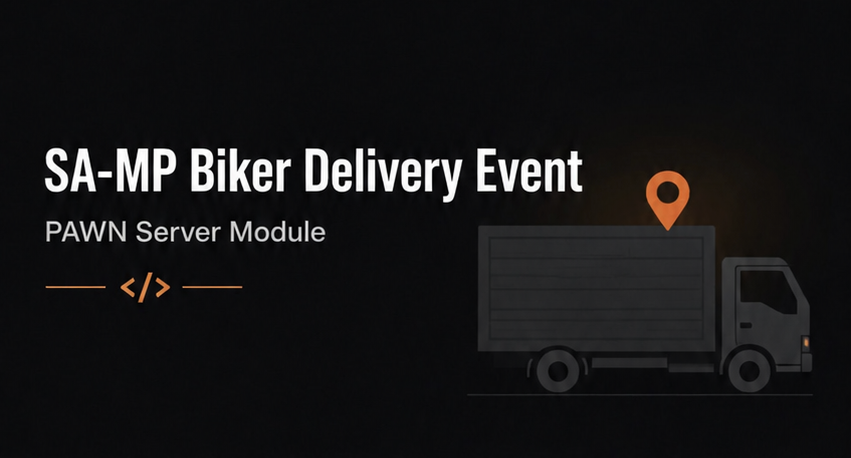

# SA-MP Biker Delivery Event

A PAWN delivery event module for SA-MP biker factions.

The event spawns a Flatbed vehicle at a random location. Biker faction members must find it, take control of the vehicle, and deliver the cargo to their faction base before the event timer ends.

## Preview

  

## Features

* Random Flatbed spawn points
* Support for multiple biker factions
* Map icon tracking for faction members
* Delivery checkpoints
* Event timer and cooldown system
* Event reminders
* Vehicle destruction handling
* Faction and player reward logic
* Development/debug commands

## Requirements

* SA-MP server
* PAWN compiler
* Existing gamemode or filterscript
* Vehicle include: `a_vehicles`

## Installation

1. Download `biker_event.pwn`.
2. Add it to your SA-MP server project.
3. Connect the event logic to your gamemode or filterscript.
4. Implement reward functions for your own server economy.
5. Compile the project.
6. Restart the server.

## Usage

The event can start automatically after cooldown or manually through a debug command.

Default event settings:

* Event duration: 30 minutes
* Event cooldown: 90 minutes + random delay
* Event vehicle: Flatbed
* Supported factions: 10 biker factions

## Development Commands

These commands are included for testing and development:

* `/be_debug_faction` — set test faction
* `/be_debug_start` — manually start the event
* `/be_debug_car` — teleport to the event vehicle
* `/be_debug_base` — teleport to the faction delivery point

Remove or protect these commands before using the module on a live server.

## Notes

* Reward functions are placeholders and must be connected to your server systems.
* Some coordinates and faction names are server-specific.
* Check the code before using it on a production server.
* Do not publish private server configuration, passwords, IP addresses, or tokens.
